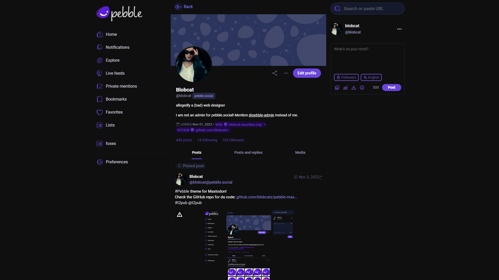

# Pebble theme for Mastodon

T2/Pebble theme for Mastodon. The theme currently doesn't support the advanced interface and I don't have plans for it, as Pebble never had it in the first place. *But if a group of people will want to see it happen at some point, I'll see what I can do*.

## How to install as default theme (Instance admins)
Get the [latest release](https://github.com/blobcatz/pebble-mastodon-theme/releases/latest) (or clone from main, despite not being released yet, all changes are checked and there shouldn't be any issues) and copy the contents of `layout-single-column.css`, paste it to the Custom CSS in the Appearance settings in your instance (https://example.com/admin/settings/appearance).

## ~~How to install as default theme (Invidual users)~~
~~Install an extension that supports userstyles, Stylus is recommended ([Download for Chromium browsers](https://chrome.google.com/webstore/detail/stylus/clngdbkpkpeebahjckkjfobafhncgmne), [Download for Firefox](https://addons.mozilla.org/firefox/addon/styl-us/)).
Go to [the theme's page on UserStyles.world](https://userstyles.world/style/12847/pebble-theme-for-mastodon) and install it.~~
The userstyle is not up-to-date since I have problems with logging into my UserStyles.world account, make a new style yourself by copy and pasting the CSS code.

### Credits
The theme uses some icons from T2/Pebble and some code for the bottom navigation bar from https://github.com/ronilaukkarinen/mastodon-bird-ui under MIT License
